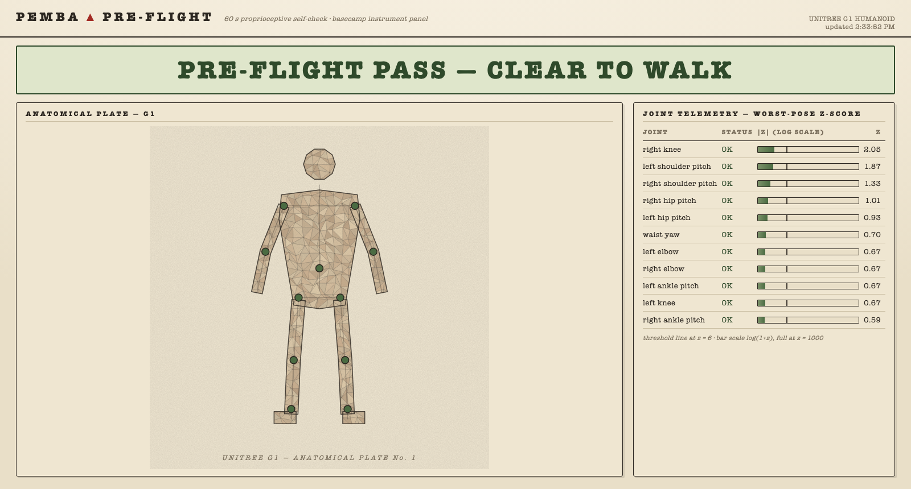
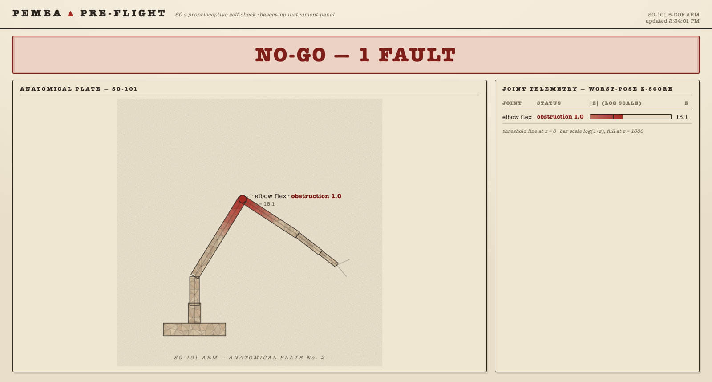
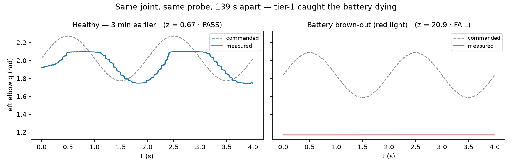

# Pemba Pre-Flight

**60-second proprioceptive self-check for expedition humanoids.** Before the robot walks, every joint gets a gentle low-gain wiggle; two detection tiers decide *go / no-go* and name the fault. Himalaya Robotics Hack 2026, Track 3 (Thinking) + LiveKit voice challenge.

> Robot Everest's waist-lock incident (livestream 25:40): a mechanical fault nobody noticed until the robot was above basecamp. A stock kp=500 position controller **muscles through** most joint faults — the error signal is invisible. Pemba probes at **kp=40**, where friction, stiffness, obstruction, and derating all leave clear signatures.

|  |  |
|:--:|:--:|
| *Real G1, all 11 joints nominal* | *Real SO-101, elbow zip-tied on camera: obstruction, z=15.1* |

The basecamp instrument panel (`viz/`) renders the robot as an anatomical plate — faulted joints show as inflamed tissue, telemetry lists worst-pose z per joint. It polls `results.json`, so it live-updates as the check runs.



*Not staged: during our real G1 gantry session, the battery died mid-collection. Tier-1 flagged the browning-out elbow at z=20.9 against a healthy median of z≈1.2 — the system caught a real, unplanned fault before we did.*

## How it works

Each joint is driven with a 0.25 rad, 0.5 Hz sinusoid for 4 s at low PD gains (kp=40, kd=2), in two poses (neutral + gravity-loaded). From each trace we extract 5 features: `rms_err, peak_err, coverage, rms_tau, phase_lag`.

- **Tier 1 — anomaly (go/no-go):** robust z-score (median/MAD) per joint-pose against the robot's **own** healthy baseline, collected on real hardware. Immune to the sim2real gap by construction. Threshold z=6; healthy leave-one-out holdout: **52/58 pass (G1), 101/102 (SO-101), median z=1.4** — thresholds biased toward false alarms over misses, because a pre-flight miss is the Everest waist-lock.
- **Tier 2 — diagnosis (named fault + severity):** HistGradientBoosting classifier + severity regressor trained on a **3,960-trace MuJoCo corpus** (Modal fan-out; 4 fault classes × severities × 11 joints × 2 poses). Trains on *features*, not raw traces — the sim2real defense. **98.3% cross-validated accuracy.**

```
verdict:  "left knee: high friction, moderate (0.6). NO-GO — inspect before ascent."
```

## Layout

```
preflight/
  protocol.py        # probe constants + joint tables — single source of truth
  features.py        # trace → 5 features
  anomaly.py         # tier-1 robust z-score model
  check.py           # CLI: the pre-flight check itself
  fit_baseline.py    # fit tier-1 from real probe traces
  validate_baseline.py  # leave-one-out healthy holdout
  report.py          # verdict sentences + go/no-go
  real/g1_probe.py   # G1 probe (unitree_sdk2py, runs on the Orin)
  real/so101_probe.py# SO-101 arm probe (lerobot)
  real/mock_lowlevel.py # laptop dry-run mock
  sim/g1_probe_env.py   # MuJoCo probe env with fault injection
  sim/corpus_modal.py   # Modal corpus generation + tier-2 training
  voice/agent.py     # "Pemba, how do you feel?" — LiveKit voice agent
```

## Setup

```bash
uv sync
git clone --depth 1 --filter=blob:none --sparse https://github.com/google-deepmind/mujoco_menagerie.git \
  && cd mujoco_menagerie && git sparse-checkout set unitree_g1 && cd ..
uv run pytest -q   # 7 tests
```

## Run it

```bash
# Simulated check with an injected fault (no hardware needed):
uv run python -m preflight.check --inject stiffness:left_knee_joint:0.7

# Real-hardware check from recorded probe traces:
uv run python -m preflight.check --source npz:data/d1_cold --baseline data/baseline_g1.json \
  --joints left_knee_joint right_knee_joint waist_yaw_joint

# Fit a tier-1 baseline from a directory of healthy probe traces:
uv run python -m preflight.fit_baseline data/d1_cold --out data/baseline_g1.json

# On the robot (Jetson Orin, after dev-mode / green face light):
python3 preflight/real/g1_probe.py --iface enP8p1s0 --reps 5 --out data/d1

# Voice — ask "Pemba, how do you feel?" (console mode, local mic/speaker):
uv run --extra voice python preflight/voice/agent.py console

# Basecamp instrument panel:
python3 -m http.server 8787 -d viz   # then open http://localhost:8787
```

Exit code 0 = "Pre-flight PASS. Clear to walk." · 1 = NO-GO with named faults.

## Safety

The probe damps every joint (kp=0, kd=8) on **every** exit path — SIGINT, SIGTERM, SIGHUP (ssh drop), and normal completion — with amplitudes of 0.25 rad at gains ~8% of stock. Battle-tested: three on-site power cuts and one dying battery during data collection; every survivable exit damped cleanly.

## Real-robot results (Unitree G1, 2026-08-30 gantry session)

- 58 healthy traces across all 11 probed joints × 2 poses → fitted baseline
- First hardware verdict: **"Pre-flight PASS. Clear to walk."** on all 11 joints
- Live catch: two battery brown-outs flagged at z=21–186 (see figure above)
- Motor temps 39→56°C across the session, recorded per-probe (`assets/session_temps.png`)

## Live fault injection (SO-101 arm, on camera)

Filmed end-to-end at the venue: healthy probe → **PASS** → elbow zip-tied on
camera → re-probe → **"elbow flex: motion obstructed (severe) — check for
transport lock or snag. NO-GO."** (z=15.1 vs threshold 6). The tight-tie case
initially slipped past tier-1 — the coverage MAD floor was diluting a 73%
range collapse — so we swept the floor against both robots' healthy holdouts
and tightened it (0.15→0.05), a fix validated on healthy data, not tuned on
the fault.

## Voice: "Pemba, how do you feel?" (LiveKit challenge)

`preflight/voice/agent.py` — a LiveKit Agents voice loop (Deepgram STT →
gpt-4o-mini → OpenAI TTS, multilingual turn detector). Ask Pemba how it feels
and it runs the real check as a tool call and speaks the verdict, faults
verbatim: *"Pre-flight check failed. Elbow flex: motion obstructed (severe) —
check for transport lock or snag. Advise not to walk."* Joints and baseline
auto-detect from the trace source, so the same agent voices both robots.

## Credits

MuJoCo Menagerie G1 model (Google DeepMind, BSD-3) · unitree_sdk2_python (Unitree) · lerobot (Hugging Face) · LiveKit Agents · Modal (compute credits).
